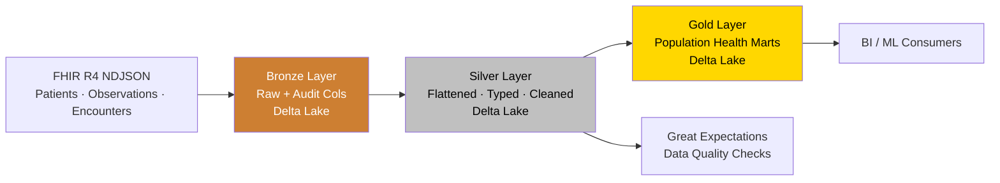

# FHIR Lakehouse — Healthcare Data Pipeline

A production-style **Medallion Lakehouse** for healthcare data, built on **PySpark + Delta Lake** with **FHIR R4** clinical resources as the source format. Demonstrates Bronze/Silver/Gold layering, schema evolution, data quality validation with Great Expectations, and analytics-ready aggregations for population health use cases.

> Personal project built to explore modern healthcare data engineering patterns end-to-end on a local development setup.

---

## Architecture



### Layer responsibilities

| Layer | Purpose | Format | Transformations |
|-------|---------|--------|-----------------|
| **Bronze** | Immutable raw landing zone | Delta | Add ingestion metadata only (no business logic) |
| **Silver** | Clean, typed, query-ready | Delta | Flatten nested FHIR, type cast, deduplicate, null handling |
| **Gold** | Business-ready analytical marts | Delta | Aggregations, joins, KPIs (e.g. readmission rates, encounter volumes) |

### Why Medallion?

The Medallion pattern gives us a clear separation between *raw provenance* (Bronze, never lost), *cleaned facts* (Silver, the source of truth for analytics), and *business marts* (Gold, opinionated views built for specific consumers). It makes pipelines reproducible — if the Gold logic changes, we can reprocess from Silver without re-ingesting source systems.

---

## Tech Stack

- **Python 3.11** — pipeline language
- **Apache Spark 3.5** — distributed processing engine
- **Delta Lake 3.2** — ACID storage layer with schema evolution and time travel
- **Great Expectations** — data quality and validation framework
- **FHIR R4** — HL7 healthcare interoperability standard

---

## Project Structure

```
fhir-lakehouse/
├── config/
│   └── config.py                  # Centralized paths and constants
├── data/
│   ├── raw/                       # Source FHIR NDJSON files
│   ├── bronze/                    # Raw Delta tables (Bronze layer)
│   ├── silver/                    # Cleaned Delta tables (Silver layer)
│   └── gold/                      # Analytical marts (Gold layer) — TODO
├── pipelines/
│   ├── bronze_ingestion.py        # FHIR JSON → Bronze Delta
│   ├── silver_transform.py        # Bronze → Silver (flatten/clean)
│   └── gold_aggregations.py       # Silver → Gold (TODO — interview task)
├── quality/
│   └── expectations.py            # Great Expectations validation suite
├── utils/
│   ├── spark_session.py           # Spark + Delta Lake builder
│   └── logger.py                  # Structured logging
├── tests/
│   └── test_silver_transform.py   # Unit tests for transformations
├── run_pipeline.py                # End-to-end orchestrator
├── requirements.txt
├── setup.sh                       # One-shot setup script
├── .gitignore
└── README.md
```

---

## Quick Start

### Prerequisites

- **Python 3.11+** — `python3 --version`
- **Java 11 or 17** — required by PySpark (`java -version`)
  - Mac: `brew install openjdk@17`
- **Git**

### Setup

```bash
# 1. Clone
git clone <your-repo-url>
cd fhir-lakehouse

# 2. Create virtual env and install deps
python3 -m venv venv
source venv/bin/activate
pip install -r requirements.txt

# 3. (Optional) one-shot setup
chmod +x setup.sh && ./setup.sh
```

### Run the pipeline end-to-end

```bash
# Run all layers
python run_pipeline.py

# Or run individual layers
python -m pipelines.bronze_ingestion
python -m pipelines.silver_transform

# Run data quality checks
python -m quality.expectations

# Run unit tests
python -m pytest tests/ -v
```

### Inspect the output

```bash
# Bronze table
python -c "from utils.spark_session import get_spark; s=get_spark(); s.read.format('delta').load('data/bronze/patients').show(5, truncate=False)"

# Silver table
python -c "from utils.spark_session import get_spark; s=get_spark(); s.read.format('delta').load('data/silver/patients').show(5, truncate=False)"
```

---

## Pipeline Status

| Component | Status | Notes |
|-----------|:------:|-------|
| Bronze ingestion (Patient, Observation, Encounter) | ✅ | Delta with ingest metadata |
| Silver flattening (Patient, Observation) | ✅ | Nested FHIR → relational |
| Silver flattening (Encounter) | ⏳ | Schema scaffolded, transform TODO |
| Great Expectations on Silver | ✅ | Patient suite complete |
| **Gold layer aggregations** | 🔲 | **Next: encounter readmission mart** |
| Airflow DAG wrapper | 🔲 | Currently using simple orchestrator |
| dbt models on Silver | 🔲 | Future enhancement |
| CI/CD with GitHub Actions | 🔲 | Future enhancement |

### Next feature to build

**Gold-layer encounter analytics mart** with:
- Patient encounter counts by month, facility, encounter type
- 30-day readmission flag (encounters within 30 days of a prior discharge for the same patient)
- Average length-of-stay by encounter class

This is the planned next milestone and the focus of ongoing development.

---

## Design Decisions

**Why Delta Lake over plain Parquet?**
ACID transactions (critical for healthcare audit), schema evolution (FHIR resources evolve), time travel (regulatory/debugging), and built-in upserts (`MERGE` for slowly-changing patient dimensions).

**Why flatten FHIR in Silver rather than at query time?**
FHIR resources are deeply nested. Flattening once in Silver lets every downstream consumer (BI, ML, ad-hoc) query a normal columnar table without parsing JSON. The Bronze layer preserves the original nested structure for audit/replay.

**Why NDJSON for source?**
FHIR Bulk Data Export ($export operation) emits NDJSON natively. Matches how this would integrate with a real EHR.

**Trade-offs accepted for this project:**
- Single-machine Spark (no cluster) — fine for the data volumes here, would move to Databricks/EMR for production
- Local file paths instead of cloud storage — easily swapped via config
- Synthetic data — production would use real bulk export with PHI controls

---

## Compliance Notes

The sample data in this repo is **fully synthetic** — no real PHI. In a production deployment, the following controls would apply:

- Field-level encryption for direct identifiers (name, MRN, SSN)
- Row/column-level access control (e.g. AWS Lake Formation, Unity Catalog)
- Audit logging on all reads of identified data
- HIPAA-compliant audit trail via Delta transaction log
- SMART on FHIR OAuth2 for any API ingestion

---

## License

MIT — personal learning project.
